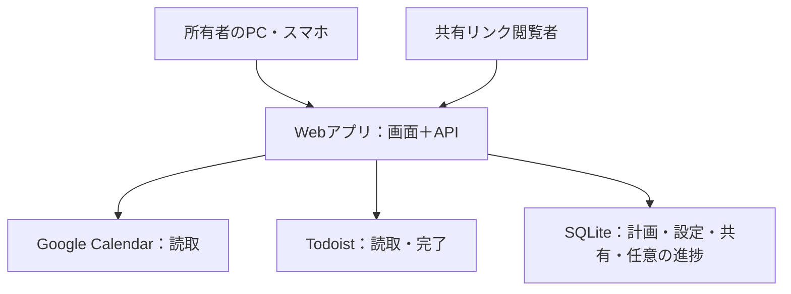

# 個人用スケジュールダッシュボード 設計書

版: 1.0 / 作成日: 2026-10-03 / 対象: 通常のWebアプリ開発経験を持つエンジニア

## 1. 目的と設計方針

PC・スマートフォンのブラウザから、外部の予定と自分の作業計画を一画面で確認する。必要なときだけ、相手に予定内容を見せず空き時間をURLで共有する。任意機能として、毎日指定時刻を境に進捗が未完了へ戻るタスクを扱う。

既存サービスのデータを複製して管理せず、独自に必要なデータだけ保存する。Google Calendarへの書き戻し、双方向同期、Webhook、MCP、AI、自動配置、予約受付は実装しない。認証と外部API連携は必要な実装として扱う。

### 採用する構成

| 区分 | 正本・保存先 | 用途 | ダッシュボードの操作 |
|---|---|---|---|
| 通常タスク Task | Todoist | 一度完了させる仕事、見積時間、締切 | 一覧取得、完了。追加・編集はTodoist |
| 固定予定 Event | Google Calendar | 講義・会議・招待など | 読み取り。追加・編集はGoogle Calendar |
| 作業計画 Block | アプリDB | タスクに割り当てた開始・終了時刻 | 作成、移動、削除 |
| リセットタスク Routine（任意） | アプリDB | 毎日繰り返す作業の定義 | 作成、編集、停止 |
| 期間別進捗 RoutineProgress（任意） | アプリDB | 当該日の回数・完了状態 | 進捗更新 |
| 共有リンク Share | アプリDB | 共有範囲・有効期限・失効状態 | 作成、一覧、失効 |

TaskとEventはアプリ内部の読取モデルであり、独自の同期テーブルを作らない。Blockにはタスク参照と時刻だけを持たせる。空き時間・割当時間・完了率は計算値とし、保存しない。

## 2. 初版の前提と範囲

- 利用者は1人。所有者のGoogleアカウント1つだけがログインできる。共有リンク閲覧者はログイン不要。
- 所有者のタイムゾーンは `Asia/Tokyo` 固定。表示・日付境界は日本時間、DBの日時はUTCとする。
- Googleカレンダーは所有者が選択したものだけ読み取る。初版は50個以内とする。
- Zoom・大学のICSなどはGoogle Calendar側で取り込む。ダッシュボードに専用コネクタは追加しない。Google側に反映されていない予定は計算対象にならない。
- 共有は「相手が空き時間を確認する」機能。予約、承認、招待、相手のカレンダーとの照合は対象外。
- リセットは毎日1回、タスクごとの指定時刻に行う。初期値は04:00。週次・月次・任意RRULEは対象外。
- 「進捗」は達成回数と定義する。チェック式は目標1回、例えば運動なら目標3回にできる。実作業時間やチェックリストの履歴は対象外。
- Todoistの繰り返しタスクは本画面で配置・完了しない。Todoistで操作する。定時リセットを必要とするものはRoutineとして登録し、2サービス間の変換や同期はしない。
- Todoistの所要時間・締切が未設定または利用不可でも動作する。所要時間がないタスクはブロック作成時に時間を入力し、Todoistへの補完保存はしない。

この範囲を拡張する場合は、受け入れ条件とデータ構造を更新してから実装する。

## 3. システム構成



### 実装・運用の基準

- TypeScriptのWebアプリ1つとSQLite1つ。UIとAPIは同じオリジンで配信する。フレームワークは実装者が保守できるものを選ぶ。
- 常時起動のサーバー1台、アプリプロセス1つ、SQLiteを永続ボリュームに保存する。揮発的なサーバーレス環境のローカルファイルにDBを置かない。
- リバースプロキシでHTTPSを提供する。Google OAuthのリダイレクトURIは本番の固定URLと一致させる。
- DB操作はマイグレーションで管理し、外部キーを有効化する。SQLiteはWALモード・busy timeoutを設定する。
- 外部APIはすべてサーバー側から呼ぶ。ブラウザへアクセストークンやTodoistトークンを渡さない。
- 時刻処理はタイムゾーン対応ライブラリを利用する。日付をブラウザのローカル設定で解釈しない。
- タイムラインは既存カレンダーUIライブラリを利用してよい。スマートフォンでドラッグを必須にせず、開始日時と分数のフォームを必ず用意する。
- リセット用cron、ジョブキュー、別の同期サーバーは不要。

## 4. 画面と操作

### 4.1 メイン画面

PCではタイムラインとタスク一覧の2列。スマートフォンでは「時間軸」「タスク」を切り替える。日付切替と更新ボタンを置く。

- 固定予定は読み取り専用。作業ブロックとは色を分ける。
- タスクを選び「時間を割り当てる」でBlockを作る。PCではドラッグでも同じAPIを呼ぶ。
- Blockを移動・伸縮して計画を変更する。削除は計画だけを消し、タスクの完了を取り消さない。
- タスク完了は明示操作。Blockの終了時刻到達を完了扱いにしない。
- 完了したタスクの未来のBlockも自動削除しない。「完了済みタスクの計画」と表示して手動削除できる。時間を空けるのはBlockを削除した時点とする。
- 外部タスクを一覧で見つけられない場合、参照先を単件取得する。完了が確認できれば完了表示、削除・取得不能なら「参照先不明」と表示する。Blockとbusy扱いは維持する。
- 所要時間が180分で、90分のBlockを2つ作れば「180分割当済み」と表示する。これは実績180分を意味しない。見積時間を超えた割当は警告だけで許可する。
- 本人画面には外部データの取得時刻と取得失敗を表示する。表示中は60秒ごと、画面復帰時、手動更新時に再取得する。常時WebSocket接続は不要。

### 4.2 空き時間と共有

設定画面で「活動可能時間」を曜日ごとに登録する。例えば月曜〜金曜09:00–18:00。昼休みを除く場合は09:00–12:00と13:00–18:00に分ける。予定を取り込むまでは空き時間を表示しない。

共有ボタンから期間を選び、プレビューを確認してリンクを作る。初期値は今日から7日間、期限は期間の終了時刻とする。最大期間は31日、最小表示時間は30分。相手には日時の範囲だけを表示する。

共有ページには「空き時間」「日本時間（Asia/Tokyo）」「計算時刻」「予約を確定するものではありません」を表示する。所有者名、タイトル、プロジェクト名、予定の出所、空いていない理由は返さない。

共有リンクは期間を固定したライブ表示とする。新しい予定やBlockが入ると、相手が更新したとき空き時間も変わる。活動可能時間の設定変更も既存リンクへ反映される。リンク作成時の固定スナップショットは作らない。

リンクの所持者は誰でも閲覧でき、転送も可能。特定の人だけに限定する機能ではない。初版では推測困難なトークン・期限・手動失効で管理する。

### 4.3 任意のリセットタスク

機能フラグ `ROUTINES_ENABLED=false` が初期値。無効時はRoutineのUIを隠し、Routine APIは404を返す。通常タスク・予定・共有はそのまま使える。

有効時はタイトル、目標回数、見積分数、リセット時刻を入力して作成する。進捗は `達成回数 / 目標回数` で表示し、目標1回ならチェックボックスを使う。目標到達で完了とする。

日付別タイムラインとは別に、Routine一覧には「現在の期間 10/3 04:00〜10/4 04:00」を明示する。午前2時は前日の期間に属する。未来の日のタイムラインから現在の進捗を誤更新させない。

## 5. データ設計

### 5.1 共通規則

- 外部サービスIDは文字列として扱う。数値に変換しない。
- 独自IDはUUID。日時はUTCのUnix epochミリ秒を `INTEGER` で保存する。
- APIの日時はUTCのRFC3339文字列、例 `2026-10-03T05:00:00Z`。
- 時間区間はすべて半開区間 `[start, end)`。14:00–15:00と15:00–16:00は重ならない。
- 各可変行に `version INTEGER NOT NULL DEFAULT 1` を持ち、更新時に比較する。古いversionからの更新・削除は409。
- 下記の表でNNはNOT NULL。SQLのDDLはこの制約を含めてマイグレーションとして作成する。

### 5.2 設定

`app_settings` は `id=1` の1行。timezoneは `Asia/Tokyo` 固定。任意機能フラグは環境変数に置き、DBと二重管理しない。

認証用の `google_credentials` は所有者1件だけ持つ。`owner_sub TEXT PK`、`refresh_token_ciphertext TEXT NN`、`updated_at INTEGER NN`。暗号化時のnonce・認証タグをciphertextの保存形式に含め、認証付き暗号方式を用いる。アクセストークンは期限付きメモリ保持を基本とする。セッションの形式・必要なテーブルは選んだ認証ライブラリの標準方式に従い、同ライブラリのマイグレーションも管理する。

`selected_calendars`:

| カラム | 型・制約 | 意味 |
|---|---|---|
| calendar_id | TEXT PK | Google CalendarのID |

同じ選択集合を本人表示・共有のbusy計算の双方で用いる。「見せる予定だけ選択してbusyを漏らす」設定は設けない。カレンダー名は取得時の表示データであり保存不要。

`weekly_windows`:

| カラム | 型・制約 | 意味 |
|---|---|---|
| id | TEXT PK | 行ID |
| weekday | INTEGER NN、0〜6 | 月曜=0、日曜=6 |
| start_minute | INTEGER NN、0〜1439 | 日本時間の午前0時からの分数 |
| end_minute | INTEGER NN、1〜1440 | 同上、終了側 |

`start_minute < end_minute`。同曜日の重複区間を拒否する。日跨ぎは曜日ごとに分割する。設定更新は配列の一括置換をトランザクションで行い、app_settingsのversionで競合検知する。

### 5.3 作業ブロック

`blocks`:

| カラム | 型・制約 | 意味 |
|---|---|---|
| id | TEXT PK | ブロックID |
| todoist_task_id | TEXT NULL | 通常タスクへの参照 |
| routine_id | TEXT NULL、FK→routines.id | 任意のリセットタスクへの参照 |
| routine_cycle_start | INTEGER NULL | Routineに割り当てた期間の開始時刻 |
| start_at | INTEGER NN | 開始 |
| end_at | INTEGER NN | 終了 |
| version | INTEGER NN | 競合検知 |

制約:

1. `start_at < end_at`。
2. 通常タスク参照とRoutine参照はどちらか一方だけ指定する。
3. 通常タスクの場合 `routine_cycle_start IS NULL`。
4. Routineの場合 `routine_cycle_start IS NOT NULL`。開始時刻から求めた期間と一致し、終了時刻は当該期間の終了以下。
5. 外部IDはDB外部キーにしない。GoogleイベントIDもBlockに保存しない。
6. indexは `(start_at, end_at)`、`todoist_task_id`、`(routine_id, routine_cycle_start)`。

同一タスクに複数のBlockを許可する。タイトル・見積時間・締切・進捗はBlockへ複製しない。Block同士の重複は初版では許可し、本人画面で警告する。固定予定との重複も警告する。外部予定は後から変わるため、完全な排他予約は約束しない。

### 5.4 リセットタスク（任意）

`routines`:

| カラム | 型・制約 | 意味 |
|---|---|---|
| id | TEXT PK | 定義ID |
| title | TEXT NN、1〜200文字 | 作業名 |
| target_count | INTEGER NN、1〜10000 | 期間ごとの目標回数 |
| estimate_minutes | INTEGER NULL、指定時は正数 | 1期間全体の見積分数 |
| reset_minute | INTEGER NN、0〜1439 | 日本時間のリセット時刻 |
| active_from | INTEGER NN | 作成時刻 |
| archived_at | INTEGER NULL | 停止時刻 |
| version | INTEGER NN | 競合検知 |

`routine_progress`:

| カラム | 型・制約 | 意味 |
|---|---|---|
| routine_id | TEXT NN、FK→routines.id | 対象定義 |
| cycle_start | INTEGER NN | 対象期間の開始時刻 |
| completed_count | INTEGER NN、0以上 | 実際の達成回数 |
| version | INTEGER NN | 競合検知 |
| updated_at | INTEGER NN | 更新時刻 |

PKは `(routine_id, cycle_start)`。目標超過は拒否する。完了boolや完了率は保存しない。行がなければ `completed_count=0, version=0` と解釈する。

タイトル・見積は編集可能。初版ではreset_minuteとtarget_countは作成後変更不可とする。変更したい場合は停止して新規作成する。これにより過去の進捗と期間の再解釈を避ける。停止済み定義は物理削除しない。停止前の履歴・Blockは保持し、停止後のBlockは本人が削除するまでbusy扱いを維持する。

### 5.5 共有リンク

`shares`:

| カラム | 型・制約 | 意味 |
|---|---|---|
| id | TEXT PK | 管理用ID、公開URLには使わない |
| token_hash | TEXT NN UNIQUE | 公開トークンのSHA-256 |
| range_start | INTEGER NN | 共有期間の開始 |
| range_end | INTEGER NN | 共有期間の終了 |
| expires_at | INTEGER NN | 失効時刻 |
| revoked_at | INTEGER NULL | 手動失効時刻 |
| min_free_minutes | INTEGER NN、1〜1440 | 表示する最小連続空き時間、初期値30 |
| created_at | INTEGER NN | 作成時刻 |
| version | INTEGER NN | 競合検知 |

`range_start < range_end`、幅31日以内、`created_at < expires_at <= range_end`。乱数32バイトをbase64urlでエンコードしたトークンを生成し、平文は作成レスポンスで一度だけ返す。管理一覧からは元のURLを復元しない。再発行は新規リンク作成と旧リンク失効で行う。

## 6. 外部APIとの境界

2026-10-03時点の公式資料を参照。実装時にもレスポンス型と利用条件を公式資料で確認する。旧Todoist REST v2を前提にしたコードを流用しない。

### 6.1 Google Calendar

- Google OAuthのWebサーバーフローで認証・認可する。ログイン用 `openid email` と読取用 `https://www.googleapis.com/auth/calendar.readonly` を要求する。この読取スコープでカレンダー選択・予定表示・free/busy取得をまかなう。
- `calendarList.list` はページを最後まで取得し、初版では `reader` 以上のカレンダーだけ選択可能にする。
- 本人の予定表示は `events.list`。表示期間を `timeMin/timeMax` で指定し、`singleEvents=true`、`showDeleted=false`。ページネーションを最後まで処理する。繰り返し予定の展開を自作しない。
- 終日予定はGoogleが返す日付とそのカレンダーのタイムゾーンから区間へ変換する。終了日は排他的。本人画面では終日欄にも表示する。
- busy計算は本人画面・共有画面ともに `freeBusy.query` を使用し、選択した全カレンダーの区間を取得する。Event一覧から独自にbusy状態を再構築しない。
- HTTP成功でもカレンダー単位にerrorsが返ることがある。選択集合の全件成功を必須とし、一部失敗時は空き時間を返さない。
- Zoom等の予定内容には依存しない。Googleに入った予定として扱う。

### 6.2 Todoist

- 所有者1人のため、初版は個人APIトークンをサーバーの環境変数で設定する。TodoistのOAuth接続管理は追加しない。
- 現行API v1のタスク取得・単件取得・完了APIをアダプターに閉じ込める。取得一覧はcursorを最後まで処理する。
- 画面用モデルは `{id, title, projectId, estimateMinutes, deadlineDate, isRecurring, isCompleted, url}`。必要ならプロジェクト一覧を取得して名前解決する。
- `duration` はAPIの単位を確認して分へ正規化する。未設定はnull。`deadline` を締切として扱い、`due` を無条件に締切へ置換しない。
- Blockへの割当はTodoistのdue日時・durationを変更しない。
- 完了は `POST /api/v1/tasks/{task_id}/close` をサーバー側から実行する。成功後に表示用データを再取得する。タイムアウト時に成功表示しない。
- 完了操作が不明な状態での再試行は、単件取得で状態を確認してから行う。繰り返しタスクでは本画面からcloseを実行しない。
- Todoist停止中でもGoogle＋Blockによる共有は動作できる。タイトル解決不能なBlockもbusy区間としては有効。

## 7. 空き時間の計算

本人表示と公開表示で同じ `calculateAvailability` 関数を使用する。公開APIには結果の日時だけを渡す。

```text
allowed = 曜日別活動可能時間を指定期間の実際の日時区間へ展開
googleBusy = 選択した全カレンダーのfreeBusy結果
blockBusy = 指定期間と重なる全Block
busy = merge(clip(googleBusy + blockBusy, range))
free = subtract(clip(allowed, range), busy)
```

1. 区間を対象範囲へ切り詰め、長さ0の区間を除く。
2. busyを開始時刻でソートし、重複・隣接区間を結合する。
3. 活動可能区間から結合済みbusyを差し引く。
4. 本人表示の空き分数は差し引き後の区間長を合計する。重複する予定・Blockを二重控除しない。
5. 公開表示だけ、開始を `max(range_start, 現在時刻)` へ切り詰め、最小連続時間未満の区間を除く。秒を含む場合は開始を分単位に切り上げ、終了を切り下げる。
6. 公開APIから受けるのはトークンだけ。閲覧者が任意の期間やcalendar_idを指定できないようにする。

本人画面は「1日の空き」と「今からの空き」を別に表示する。前者は過去時間を含む日全体、後者は現在時刻以降だけ。共有の最小表示時間フィルタは本人の合計空き分数に適用しない。

### 計算例

活動可能09:00–18:00、固定予定10:00–11:00と10:30–12:00、Block14:00–15:30の場合:

- busy: 10:00–12:00、14:00–15:30。
- free: 09:00–10:00、12:00–14:00、15:30–18:00。
- 空き合計: 330分。固定予定の重なり30分を二重控除しない。

### 取得頻度とエラー

Google free/busyはサーバー内メモリで最大60秒キャッシュする。キーは選択カレンダー集合＋期間。取得が完全成功した結果だけを保存する。設定変更で破棄する。BlockはリクエストごとにDBから読むため、ローカル変更は直ちに反映する。

同じキーの同時取得を1回にまとめる。外部APIタイムアウトは10秒、429・一時的5xxは短いバックオフで最大1回だけ再試行する。期限切れキャッシュを使って公開空き時間を表示しない。取得不能時は503と「現在確認できません」を返し、空のbusyから「全部空き」を生成しない。

共有は最大60秒の外部情報遅延を持ち、予約枠を確保しない。予定を約束する際は当事者間で確認する。

## 8. 指定時刻リセットの実装

既存の進捗を0に上書きするのではなく、現在時刻に対応する期間の進捗を参照する。新しい期間の行がなければ未着手0回となる。サーバーが停止していても、次回アクセス時に正しい期間を選べる。

### 期間計算

```text
cycleAt(time, resetMinute):
  localDate = timeを日本時間で表した日付
  boundary = localDateのresetMinuteに対応する日時
  if time < boundary:
    boundary = 前日の同時刻
  return [boundary, 翌日の同時刻)
```

例: reset=04:00。

| 現在時刻（日本時間） | 参照する期間 | 進捗 |
|---|---|---|
| 10/3 03:59:59 | 10/2 04:00〜10/3 04:00 | 前期間の値 |
| 10/3 04:00:00 | 10/3 04:00〜10/4 04:00 | 行がなければ0 |
| 10/8に久しぶりに開く | 10/8の該当期間 | 行がなければ0 |

過去の行を変更しない。アクセスしなかった期間の0行を大量生成しない。作成直後は、その時点を含む期間から利用可能とする。

### 更新処理

1. クライアントは `cycleStart`、絶対値の `completedCount`、`expectedVersion` を送る。加算APIを作らず、同じ送信の再実行で二重加算しない。
2. サーバーの現在時刻から期間を計算し、cycleStartが一致するか確認する。
3. 一致しなければ409 `CYCLE_CHANGED`。現在の期間を返し、画面で再取得する。古い画面の完了を新期間に自動適用しない。
4. DBトランザクション内で、行なし＋expectedVersion=0なら作成。既存行はversion一致時だけ更新する。進捗範囲と定義の有効性を検証する。
5. 409のversion競合時は再取得し、ユーザーが改めて操作する。失敗した更新をUI上で確定しない。

境界判定はトランザクション開始時のサーバー時刻を採用する。04:00前に受理した操作は旧期間へ書き、04:00以降に受理した操作は旧期間指定を拒否する。

画面表示中は次の境界に合わせたタイマーと60秒更新で再取得する。スリープ復帰時にも再取得する。タイマーは表示更新の補助であり、正しい期間の決定はサーバーが行う。

### Blockとの関係

RoutineのBlockは開始時刻から割当期間を決定する。未来の期間に作成してよい。1つのBlockはリセット境界を跨げず、跨ぐ作業は2つへ分割する。Routineの完了とBlockの長さは連動しない。進捗が0へ戻っても、過去のBlock・過去の進捗を削除しない。

## 9. HTTP API

以下はアプリ独自API。すべてJSON。公開系以外は所有者セッション必須。ID・日時・数値をサーバーで検証する。

| メソッド・パス | 入力・動作 | 主な戻り値 |
|---|---|---|
| GET /api/day?date=YYYY-MM-DD | 指定日を日本時間で解釈 | events, blocks, tasks, currentRoutines, freeIntervals, fetchedAt, errors |
| GET /api/settings | 活動可能時間・カレンダー選択取得 | settingsVersion, weeklyWindows, selectedCalendarIds |
| PUT /api/settings | 配列一括置換＋expectedVersion | 更新後設定 |
| GET /api/calendars | Googleカレンダー候補取得 | id, title, accessRole |
| POST /api/blocks | タスク参照、startAt、endAt | 作成Block |
| PATCH /api/blocks/:id | startAt、endAt、expectedVersion | 更新Block |
| DELETE /api/blocks/:id | expectedVersion | 204 |
| POST /api/tasks/:id/complete | Todoist完了、繰り返しは422 | 完了確認結果 |
| POST /api/shares/preview | rangeStart, rangeEnd, minFreeMinutes | 本番と同じ計算結果 |
| POST /api/shares | 同上＋expiresAt | shareId、公開URL（一度のみ） |
| GET /api/shares | 管理一覧、トークンなし | id, range, expiresAt, revokedAt, version |
| POST /api/shares/:id/revoke | expectedVersion | 更新状態 |
| GET /api/public/availability/:token | 有効リンクのみ評価 | 公開用DTO |
| GET /api/routines | 現期間の定義と進捗 | cycleStart, cycleEnd, count, target, version |
| POST /api/routines | title, targetCount, estimateMinutes, resetMinute | 定義 |
| PATCH /api/routines/:id | title, estimateMinutes、expectedVersion | 更新定義 |
| POST /api/routines/:id/archive | expectedVersion | 停止状態 |
| PUT /api/routines/:id/progress | cycleStart, completedCount, expectedVersion | 更新進捗 |

`POST /api/blocks` の参照部分は `{todoistTaskId}` または `{routineId}` の一方だけ。routineCycleStartはサーバーが計算する。Blockの参照先変更は削除＋新規作成とし、PATCHは時刻変更だけにする。

作成APIはクライアント生成UUIDを `requestId` として渡す。Block・Routine・Shareのidに使用し、重複IDは409で新規作成しない。共有作成レスポンスが失われた場合、リンクを復元せず管理一覧で当該IDを失効し、新IDで作り直す。

### 公開レスポンスの例

```json
{
  "timezone": "Asia/Tokyo",
  "computedAt": "2026-10-03T11:00:00Z",
  "externalFetchedAt": "2026-10-03T10:59:42Z",
  "rangeStart": "2026-10-04T00:00:00Z",
  "rangeEnd": "2026-10-04T09:00:00Z",
  "freeIntervals": [
    {"start": "2026-10-04T03:00:00Z", "end": "2026-10-04T05:00:00Z"}
  ]
}
```

公開レスポンスはこの形で明示的に構築する。本人用データからタイトルだけ削除して流用する実装は禁止する。busy区間、内部ID、Googleレスポンス、Todoist情報を含めない。

エラー形式は `{error: {code, message}}`。401=未認証、403=所有者不一致、404=存在しない・失効したリンク、409=競合・期間変更、422=入力不正、429=制限、503=外部取得不能。公開ページで認証エラーの詳細・例外スタックを表示しない。

## 10. 認証・公開範囲

- 本人用ログインはGoogle OIDC対応の既存認証ライブラリを用いる。IDトークンのissuer、audience、期限、nonce等を検証する。OAuth stateを検証する。
- Calendarの認可時はofflineアクセスを要求する。未接続時にrefresh tokenが得られない場合は接続完了とせず、再認可へ案内する。ログアウトはセッションだけを終了し、共有に必要なCalendar連携を解除しない。
- 環境変数 `OWNER_GOOGLE_SUB` に所有者のGoogle subject IDを指定し、一致しないログインを拒否する。初期登録は管理者のセットアップ操作で行い、「最初にアクセスした人を所有者にする」仕組みは使わない。
- GoogleログインとCalendarアクセスは同じ所有者アカウントに紐付ける。refresh tokenは暗号化してサーバー側DBに保存し、暗号鍵は環境変数で管理する。取得済みrefresh tokenが新しい応答にない場合、既存値を消さない。
- セッションはHttpOnly・Secure・SameSite=Lax Cookie。更新APIはCSRFトークンまたは同等の仕組みとOrigin検証で保護する。CORSで任意のサイトを許可しない。
- `/share/:token` と公開APIのみ認証不要。他の画面・APIはサーバー側で毎回所有者認証を確認する。
- 共有ページは `Cache-Control: no-store`、`Referrer-Policy: no-referrer`、`X-Robots-Tag: noindex, nofollow`。第三者の分析スクリプトを入れない。
- トークンを含むパスをプロキシ・アプリのアクセスログでマスクする。APIトークン・予定本文をログへ出さない。
- 公開APIはIPごと60回/分、リンクごと30回/分を目安に制限する。単一サーバーのメモリ実装でよい。失効は公開結果キャッシュで迂回されず毎回DBで検証する。
- 失効・期限切れ・不明トークンは同じ404表示。空き0件の正常結果とは区別する。

## 11. モジュールの責務

| モジュール | 責務 |
|---|---|
| auth | 所有者ログイン、セッション、Calendar認可 |
| googleAdapter | カレンダー一覧、予定一覧、free/busy、ページ処理、トークン更新 |
| todoistAdapter | タスク一覧・単件、完了、API型の正規化 |
| blockRepository | BlockのCRUDとversion比較 |
| availability | 区間展開・結合・差し引き。外部APIやUIに依存しない純粋関数 |
| shareService | トークン・範囲・失効確認、公開DTO生成 |
| routineService | 期間計算、進捗更新、停止。任意機能をここへ隔離 |
| routes / UI | 入出力検証、画面、利用者へのエラー表示 |

外部APIエラーを空配列へ変換しない。成功した空配列と取得失敗を型で区別する。Todoistエラーは共有へ伝播させず、Google busy取得エラーは共有停止へ伝播させる。

## 12. 実装順序

1. 所有者認証、DBマイグレーション、活動可能時間、Google接続とカレンダー選択。
2. Google予定の表示・free/busy取得。全選択カレンダーの成功確認。
3. Todoist一覧・単件・完了。未設定見積・繰り返しタスクの扱い。
4. Block CRUD、2列画面、スマホ入力フォーム、空き時間計算。
5. 共有プレビュー、URL発行、公開画面、期限と失効、公開DTOの漏洩テスト。
6. 任意機能を有効にする場合だけRoutine・期間別進捗を追加する。
7. 本番OAuth設定、永続DB、バックアップ、スマホでの操作確認。

各段階で完成した機能を動作確認する。Routineなしでも工程5までで利用可能な初版とする。

## 13. 受け入れ条件・必要なテスト

| ID | 条件 | 期待結果 |
|---|---|---|
| A01 | 未ログインで本人APIへアクセス | 401。画面へデータを返さない |
| A02 | 所有者以外のGoogleアカウントでログイン | 403。Calendar連携データを保存しない |
| A03 | 1タスクに90分Blockを2つ作成 | 2つ表示。Todoistのdue・durationは変化しない |
| A04 | Blockを削除 | タスク状態は変わらず、空き時間だけ増える |
| A05 | 10–11時と10:30–12時の予定 | busyは10–12時。二重控除しない |
| A06 | 14–15時と15–16時のBlock | 隣接としてbusy結合。重複警告は出ない |
| A07 | 日跨ぎ・終日・繰り返し・キャンセル予定 | 正しい日へ表示。busyはGoogle結果と一致 |
| A08 | カレンダー選択変更 | 次の取得から反映し、旧キャッシュを利用しない |
| A09 | 共有ページを未ログインで開く | 日時だけ閲覧可能。タイトル・内部IDは応答に存在しない |
| A10 | 新しい固定予定を追加 | 外部キャッシュ期限後の共有更新で空き時間が減る |
| A11 | 新しいBlockを追加 | 次の共有更新で直ちに空き時間が減る |
| A12 | リンクの期限到達・手動失効 | 同じ404。旧結果を再配信しない |
| A13 | Google全体またはカレンダー1件が取得失敗 | 503。「全部空き」や部分的な空きを返さない |
| A14 | Todoist取得失敗 | 本人画面にエラー。Google＋Blockの共有は利用可能 |
| A15 | Routine無効 | 通常機能は利用可能。Routine UIなし、API404 |
| A16 | reset04:00、03:59:59と04:00:00 | 前期間の値から新期間0へ切替。過去値は残る |
| A17 | サーバーを数日停止して再開 | cronなしで現在期間0。未使用期間の行は増えない |
| A18 | リセット前の画面からリセット後に完了送信 | 409 CYCLE_CHANGED。新期間を完了にしない |
| A19 | 複数端末から同じversionで異なる進捗更新 | 片方成功、片方409。上書き消失しない |
| A20 | RoutineのBlockがリセット境界を跨ぐ | 422。分割を促す |
| A21 | Blockの時刻だけ変更 | 達成回数は変化しない |
| A22 | Todoistでタスクが完了・削除された | Blockは残りbusy維持。状態に応じた参照表示 |
| A23 | 共有期間外の情報をURLパラメータで要求 | 範囲を拡張できない |
| A24 | スマホでドラッグせずBlock作成・移動 | フォームだけで操作完了できる |
| A25 | Routineを完了して未来Blockが残る | Block削除まではbusy。自動で共有の空きへ変えない |
| A26 | Todoistの繰り返しタスクを操作 | 配置・完了を実行せずTodoistへの導線を表示 |
| A27 | 完了APIがタイムアウト | 完了確定を表示せず、再取得で状態確認 |
| A28 | ブラウザを境界越えでスリープ・復帰 | 再取得後に正しい現在期間を表示 |

最低限の自動テストは区間計算、cycleAtの境界、進捗トランザクションの競合、共有DTO、所有者認可、外部エラー時の共有停止。外部APIはモックし、契約確認は実アカウントで別途実施する。手動確認はPCとiPhoneブラウザで行う。

## 14. 配備・保守

必要な設定値: `BASE_URL`、`DATABASE_PATH`、`GOOGLE_CLIENT_ID`、`GOOGLE_CLIENT_SECRET`、`OWNER_GOOGLE_SUB`、`TOKEN_ENCRYPTION_KEY`、`SESSION_SECRET`、`TODOIST_API_TOKEN`、`ROUTINES_ENABLED`。

本番起動前にDBマイグレーション、HTTPS、OAuth callback、所有者限定、永続ボリュームを確認する。Google OAuthのTestingモードではCalendar等のスコープを含むrefresh tokenが短期間で失効する条件があるため、継続利用用の公開状態・対象ユーザー・必要な検証を公式仕様に沿って設定する。

SQLiteのオンラインバックアップ機能等で毎日バックアップする。WAL稼働中のDBファイル1つだけを単純コピーしない。暗号鍵の別途保管と復元手順を用意する。再起動後もBlock、リンク失効、進捗、暗号化トークンが復元されることを確認する。

Google連携が失効したら本人画面に再接続を表示し、共有は確認不能とする。Todoistトークンが失効したらタスク操作を停止し、設定更新を案内する。外部サービスの仕様変更は各adapter内で対応する。

## 15. 公式参考資料

実装契約の根拠となる資料。プロダクト独自の仕様は本設計書で定義する。

- [Google Calendar API：認可スコープ](https://developers.google.com/workspace/calendar/api/auth)
- [Google Calendar API：CalendarList.list](https://developers.google.com/workspace/calendar/api/v3/reference/calendarList/list)
- [Google Calendar API：Events.list](https://developers.google.com/workspace/calendar/api/v3/reference/events/list)
- [Google Calendar API：Freebusy.query](https://developers.google.com/workspace/calendar/api/v3/reference/freebusy/query)
- [Google OAuth：Webサーバーアプリ](https://developers.google.com/identity/protocols/oauth2/web-server)
- [Google OAuth：トークンの失効条件](https://developers.google.com/identity/protocols/oauth2#expiration)
- [Todoist API v1](https://developer.todoist.com/api/v1/)

## 16. 初版の完成定義

所有者がPC・スマートフォンから予定とタスクを確認し、Blockを作成・変更できる。固定予定とBlockを差し引いた空き時間を、期限付き・失効可能なURLで他者へ共有できる。外部取得失敗時に誤った空き時間を公開しない。任意機能を有効にした場合、指定時刻を境に新しい期間の進捗へ切り替わり、過去の進捗が保持される。

成果物はアプリ、DBマイグレーション、設定例、セットアップ手順、受け入れテスト、バックアップ・復元手順。追加のサービスや同期機構を導入せず、この範囲を満たした時点で初版完成とする。
